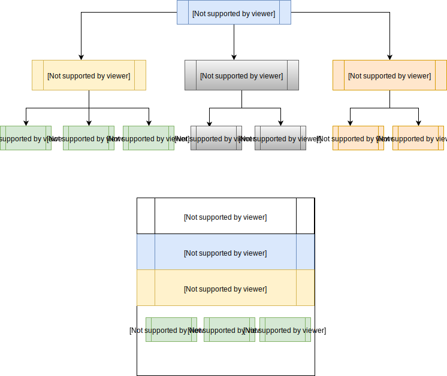

# Requirements:
- Python 3.5
- tensorflow-gpu r1.4
- spaCy
- tqdm
- tmux

# Environment Setup
```commandline
python -m spacy download en_core_web_lg

```

# CoNLL Dataset
- https://www.clips.uantwerpen.be/conll2003/ner/
- https://github.com/synalp/NER/tree/master/corpus/CoNLL-2003

# Start
- For patent_tagger keep the data in train, test, val 
 along with desired_labels in a single folder called Data


# Problems and Solutions:
- 


# Current Architecture



**References**
- https://github.com/guillaumegenthial/sequence_tagging
- https://github.com/Franck-Dernoncourt/NeuroNER