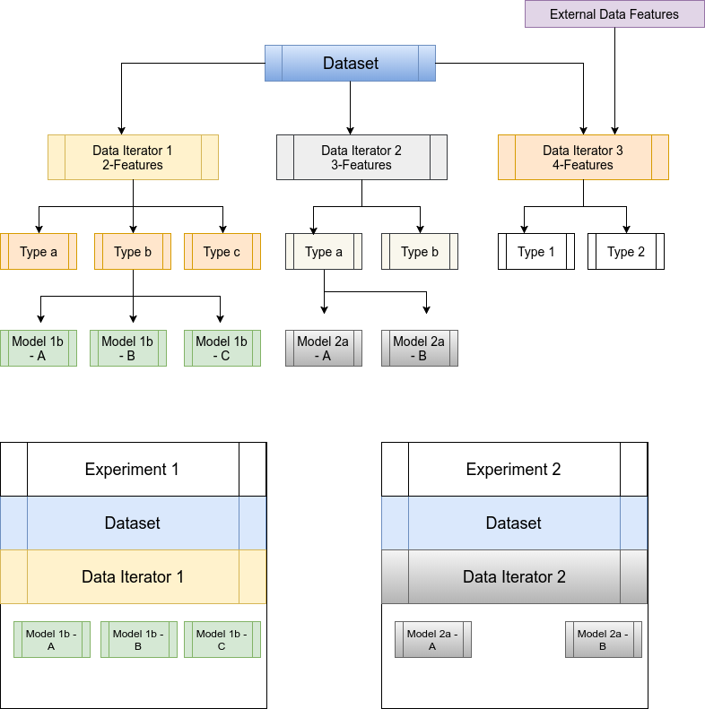

# Introduction
A simple and modular Tensorflow model development environment to handle
sequence-to-sequence models.

Developing models to solve a problem for a data set at hand,
requires lot of trial and error methods.
Which includes and not limited to:
- Preparing the ground truth or data set for training and testing
    - Collecting the data from online or open data sources
    - Getting the data from in-house or client database
- Pre-processing the data set
    - Text cleaning
    - NLP processing
    - Meta feature extraction etc.,
- Data iterators, loading and looping the data examples for model
while training and testing
    - In memory - All data is held on RAM and looped in batches on demand
    - Reading from the disk on demand in batches
    - Maitaining different feature sets (i.e number of features and its types) for the model
- Models
    - Maintaining different models for same set of features
    - Good visulaizing and debugging environment/tools
    - Start and pause the training at will
- Model Serving
    - Load a particular model from the pool of available models for a
    particular data set

# Related Work
Below two Git repos got our attention:
- https://github.com/guillaumegenthial/sequence_tagging
- https://github.com/Franck-Dernoncourt/NeuroNER

Both of the projects are excellent in their own way, however they lack few
things like support for different dataset and models in a modular way,
which plays a key role in a customer facing project(s).

# Problem Statement
 - To come up with an software architecture to try different models on
 different dataset
 - Which should take care of:
    - Preprocessing the data
    - Preparing the data iterators for training, validation and testing
    for set of features and their types
    - Use a model that aligns with the data iterator feature type
    - Train the model in an iterative manner, with fail safe
    - Use the trained model to predict on new data

# Solution or proposal

Little of Object-Oriented-Principles are infused in to Python scriptic nature,
for eay extensible and maitanance.

**What we solved using this code?**
 - Top level accuracies on open Conll dataset 2003
 - Extract information from patent documents for form filling, from historical
data entries from the Database records.

## Current Architecture

- [Handling Dataset and Preprocessing](docs/dataset.md)
- [Data iterators](docs/data_iterator.md)
    - Dataset may have one or more features like words,
characters, positional information of words etc.,
    - Extract those and convert word/characters to numeric ids, pad them etc.,
    - Enforces number of features and their types, so that set of models can work on down the line
- [Models](docs/models.md) should agree with data iterator features types and
make use of the aviable features to train the data





- [Tensorflow Estimators](https://www.tensorflow.org/extend/estimators) is used for training/evaluating/saving/restoring/predicting


### Directory Details
Each experiment starts based on a dataset.
We use CoNLL data set, since it is provided as part this repo
- conll_experiments
    - data
        - train.txt
        - test.txt
        - val.txt
    - tf_data


# Available Models:
- [Models](docs/models)
    - [Variable Length BiLSTM with CRF](docs/models/bilstm_crf_v0/BiLSTM_CRF_V0.md)


# Validation


-------------------------------------------------------------------

# Setup

## Requirements:
- Python 3.5
- tensorflow-gpu r1.4
- spaCy
- tqdm
- tmux
- overrides


## How run on GPU server: (Imginea Specific)

```bash
#run following command for one time password verification
ssh-copy-id "rpx@172.17.0.5"

ssh rpx@172.17.0.5

# One time setup
tmux new -s your_name
export PATH=/home/rpx/anaconda3/bin:$PATH

### Note following environment is already setup, 
### no need to replicate unles you wanted different versions
conda create -n tensorflow-gpu python=3.5 anaconda
export LD_LIBRARY_PATH=/home/rpx/softwares/cudnn6/cuda/lib64:$LD_LIBRARY_PATH
source activate tensorflow-gpu
python --version

```

## Anaconda Environmnet setup: (General Users)

```bash
conda create -n tensorflow-gpu python=3.5 anaconda
source activate tensorflow-gpu
```

## Environment setup:
```bash
pip install tensorflow_gpu
pip install spacy
python -m spacy download en_core_web_lg
pip install tqdm
pip install overrides
```

## Tmux (Imginea Specific)
```
cd ~/experiments/
mkdir your_name
cd your_name

git clone https://gitlab.pramati.com/imaginea-labs/i-tagger

```

**Day to day use**
```

tmux a -t your_name

### run only if you previous tmux session was closed completly
source activate tensorflow-gpu
export PATH=/home/rpx/anaconda3/bin:$PATH
export LD_LIBRARY_PATH=/home/rpx/softwares/cudnn6/cuda/lib64:$LD_LIBRARY_PATH

```

## How to test?

We are using CoNLL 2003 dataset for testing purpose.

### Data :
- https://www.clips.uantwerpen.be/conll2003/ner/
- https://github.com/synalp/NER/tree/master/corpus/CoNLL-2003

### Commands
- For running patent dataset example move to directory: i-tagger

```bash

python src/commands/patent_dataset.py --mode=preprocess
python src/commands/patent_dataset.py --mode=train 
python src/commands/patent_dataset.py --mode=retrain --model-dir=PATH TO Model
python src/commands/patent_dataset.py --mode=predict --model-dir=PATH TO Model --predict-dir=PATH to Prediction files  

``` 


### Learning Materials
- [Walk Through of Tensorflow APIs](notebooks/walk_through_of_tf_apis.ipynb)

## Web interface for the models
- Developed a flask app which will serve different models to the user.
- For running the app , move to directory: i-tagger

```bash

python src/app.py

- Open browser and navigate to : http://localhost:8080/predictText
  Here user can enter any text to get the tags for the entered text.

OR

- Open browser and navigate to : http://localhost:8080/predict
  Here user can upload a file and get the tags for the uploaded file.

TODOs:
- Remove all default params
- Tune the model for CoNLL dataset
- Add more command line options
- Documentation
- Celaning of the code
- More on LSTM basics/tutorials