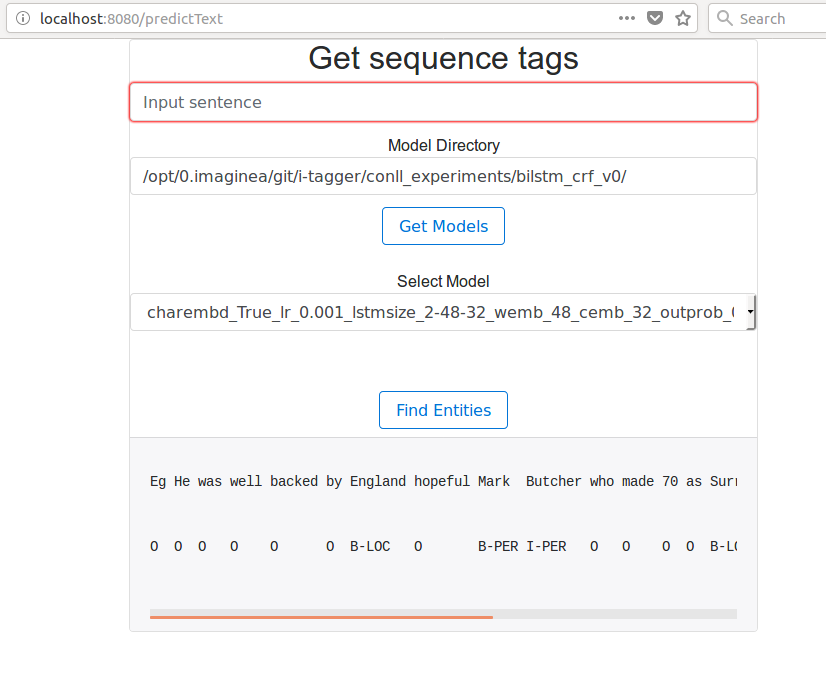

## How to test?

### Commands
- For running patent dataset example move to directory: i-tagger

#### CoNLL

We are using the CoNLL 2003 dataset for testing.


**Data :**
- https://www.clips.uantwerpen.be/conll2003/ner/
- https://github.com/synalp/NER/tree/master/corpus/CoNLL-2003

```bash
cd /path/to/i-tagger/


# Below code only transforms the data

python src/commands/tagger.py \
--experiment-name=conll_csv_experiments \
--mode=preprocess \
--preprocessor-name=conll_data_preprocessor

# 1. Data iterator is were main core logic of data preparation for the models
# happens, which should implement IDataIterator and inherit an Feature type
# 2. Model takes in the data iterator while configuring and reads
# required information from it along with user params and initializes the
# model
# 3. Tensorflow estimator is used then to train with above
# model and data iterators

python src/commands/tagger.py \
--experiment-name=conll_csv_experiments \
--mode=train \
--data-iterator-name=csv_data_iterator \
--model-name=bilstm_crf_v0 \
--batch-size=32 \
--num-epochs=5

#above when run with default params will create following model
export MODEL_PATH=conll_csv_experiments/csv_data_iterator/bilstm_crf_v0/charembd_True_lr_0.001_lstmsize_2-48-32_wemb_48_cemb_32_outprob_0.5/

python src/commands/tagger.py \
--experiment-name=conll_csv_experiments \
--mode=retrain \
--data-iterator-name=csv_data_iterator \
--model-name=bilstm_crf_v0 \
--batch-size=32 \
--num-epochs=8 \
--model-dir=$MODEL_PATH

python src/commands/tagger.py \
--experiment-name=conll_csv_experiments \
--mode=predict \
--data-iterator-name=csv_data_iterator \
--model-name=bilstm_crf_v0 \
--model-dir=$MODEL_PATH \
--predict-dir=conll_csv_experiments/preprocessed_data/test/
```


```
tensorboard --logdir=$MODEL_PATH
```


**Demo on web interface**

A pretrained model on CoNLL data set is available on `path/to/i-tagger/conll_csv_experiments/csv_data_iterator/bilstm_crf_v0/charembd_True_lr_0.001_lstmsize_2-64-48_wemb_64_cemb_48_outprob_0.5/`

Fire up the web app and test it ;)

```bash
python src/app.py
```
- Open browser and navigate to : http://localhost:8080
  Here user can select an option either to get the tags by entering the text or using file upload.

- Open browser and navigate to : http://localhost:8080/predictText
  Here user can enter any text to get the tags for the entered text.

    **How to run?**:
    Sentence: He was well backed by England hopeful Mark Butcher who made 70 as Surrey closed on 429 for seven, a lead of 234.
    Model Dir: /path/to/i-tagger/conll_csv_experiments/csv_data_iterator/bilstm_crf_v0/


- Open browser and navigate to : http://localhost:8080/predict
  Here user can upload a file and get the tags for the uploaded file.

